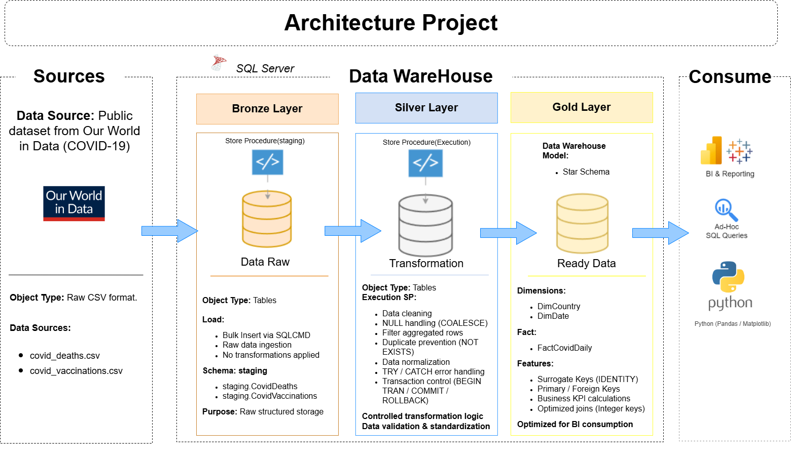
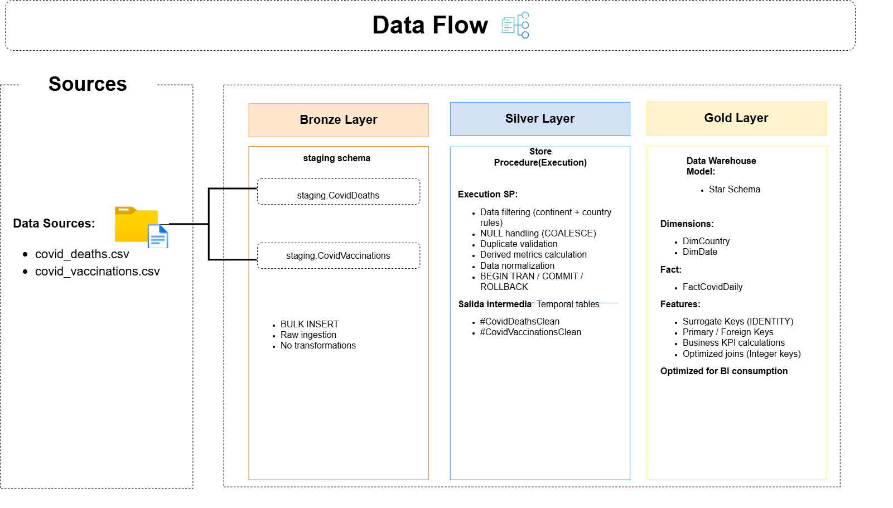

# COVID-19 LATAM Analytics Project

## 📌 Project Overview

This project analyzes the impact of COVID-19 in Peru compared to selected Latin American, North American, European, and Asian countries.

It simulates a production-ready Data Engineering & Analytics architecture using SQL Server, following a layered Medallion-style approach:

Sources → Bronze → Silver → Gold → BI & Advanced Analytics

The project demonstrates both Data Engineering and Business Intelligence best practices.

---


## 🛠 Technologies Used

- SQL Server (T-SQL)
- Data Warehouse (Star Schema)
- Power BI
- Python (Pandas, Matplotlib)

---

## 🏗 Data Architecture

The project follows a layered architecture:



---

## 🔄 Data Flow (Lineage)



---

## 🧠 Data Engineering Highlights

✔ Automated setup via `run_project.bat`  
✔ Transaction-safe ETL pipeline (BEGIN TRAN / COMMIT / ROLLBACK)  
✔ Error handling with TRY/CATCH  
✔ Layered architecture (Bronze/Silver/Gold)  
✔ Data validation & cleansing rules  
✔ Duplicate prevention with NOT EXISTS  
✔ Surrogate keys for optimized joins  
✔ Production-style folder structure

---

## 📈 Technical Metrics

- Rows processed: 858,870 rows
- Countries analyzed: 10+ countries across LATAM, NA, EU & Asia
- Date range: 2020 – 2024
- Full ETL runtime: ~5 seconds on local SQL Server instance

---
## ⚙ ETL Process

The transformation layer is implemented as a stored procedure:

`sp_transform_covid_data`

### ETL Features
- Data cleansing (removes aggregates like “World”)
- Country filtering rules
- NULL handling using COALESCE
- Duplicate prevention with NOT EXISTS
- Derived metric calculations:
   - Mortality Rate
   - Infection Rate
   - Vaccination Rate
- Transaction-safe execution

## 📊 Business Questions

- How did Peru compare to other LATAM countries?
- What was the infection rate evolution?
- Did vaccination impact mortality?
- Which country showed the fastest recovery?
- How did case trends vary across regions?

---

## 📂 Project Structure

/sql → Database creation, ETL and modeling  
/powerbi → Dashboard  
/python → Advanced analysis  
/dataset → Sample dataset  


```
covid19-latam-analytics/

├── run_project.bat
├── 00_run_all.sql
│
├── sql/
│ ├── 01_create_database.sql
│ ├── 02_create_schemas.sql
│ ├── 03_staging_tables.sql
│ ├── 04_load_staging_data.sql
│ ├── 05_create_dw_tables.sql
│ └── 06_transform_staging_to_dw.sql
│
├── docs/
│ ├── data_architecture.png
│ └── dataflow.png
│
├── powerbi/
│ └── covid_dashboard.pbix
│
├── python/
│ └── exploratory_analysis.ipynb
│
├── dataset/
│ └── full.zip   ← Compressed dataset
│
└── README.md
```

---

## 🚀 How to Run the Project

⚠ Important — Dataset Setup  
The dataset is compressed inside: `dataset/full.zip`

Before running the project:

1. Navigate to the dataset folder
2. Extract full.zip
3. Ensure the following files are available inside `dataset/full/:`
   * covid_deaths.csv
   * covid_vaccinations.csv

Once extracted, proceed with execution.

### Automated Setup (Recommended)

1. Make sure you have **SQL Server installed**.
2. Ensure your SQL Server instance name is: `localhost`
3. Double-click: `run_project.bat`

This will:

- Create database
- Create schemas
- Load staging data
- Create DW tables
- Execute ETL
- Populate star schema

---

## 💡 Skills Demonstrated

- Data Warehouse Design
- ETL Development (T-SQL)
- Transaction Management
- Data Cleaning & Validation
- Star Schema Modeling
- Business KPI Design
- BI Dashboard Development
- Git Version Control

---
## 📊 Data Source

[Our World in Data – COVID-19 Dataset](https://ourworldindata.org/coronavirus)

---

## 👨‍💻 Author

Wilmer Lozano  
Data Analytics & BI Portfolio Project